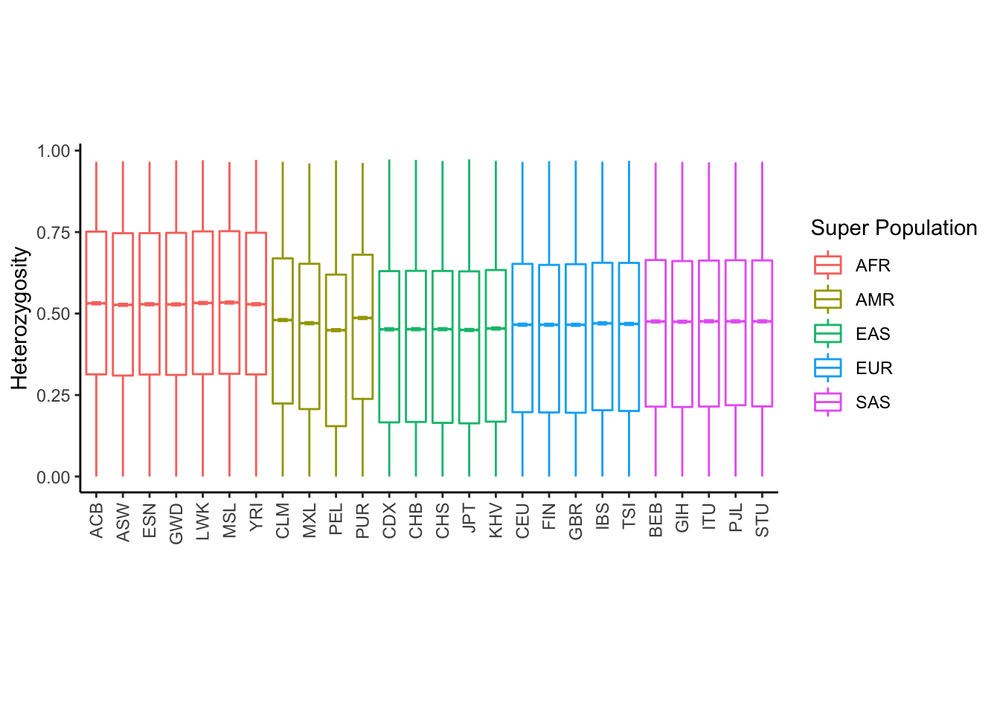
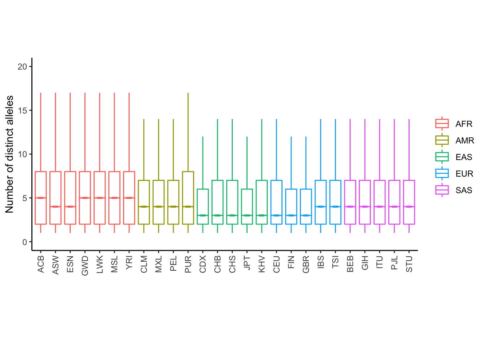

# Polymorphism of STRs in 1000 Genomes Project samples

Here we analyzed size distribution of polymorphic STRs within 2,504 samples from 1000 Genomes Project.

## Summary of polymorphism stratified by populations
We examined polymorphism of polymorphic STRs. As expected, we observed that AFR population has the highest polymorphism compared to other super populations.

