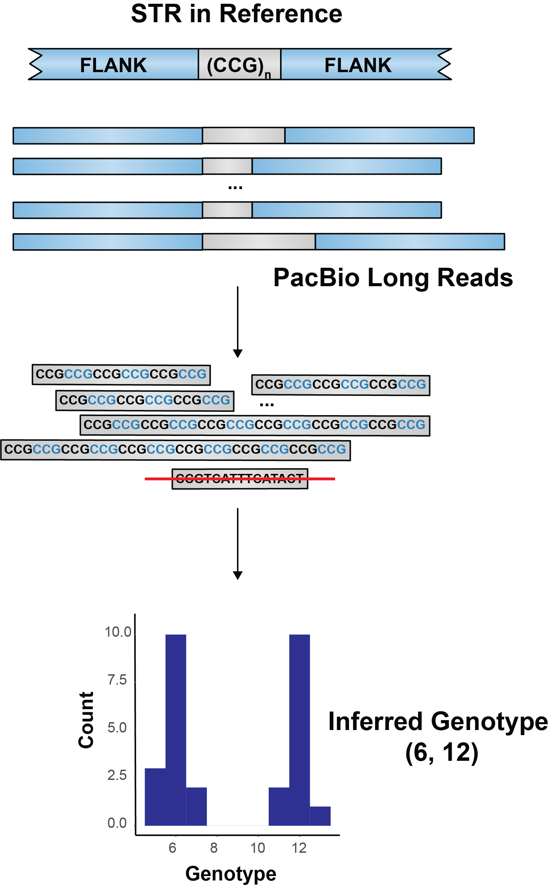

# STR Truthset

To facilitate the use of STR catalogs, we also generated truthsets for STR catalogs using PacBio CCS reads. The truthset for NA12878 are stored within the same folder as the catalog.

Briefly, we extracted CCS reads that spans the entire STR, count sizes of the STR from the extracted reads, and then infer genotype of the STR.

  

The CCS-based genotype is still under development and can only support single-unit STRs without ambiguous bases. In addition, CCS reads may suffer high indel errors for short STRs. To generate the truthset, we also genotyped STRs in 28 whole genome sequencing data using Illumina data and kept the ones that are consistent across all replicates.
