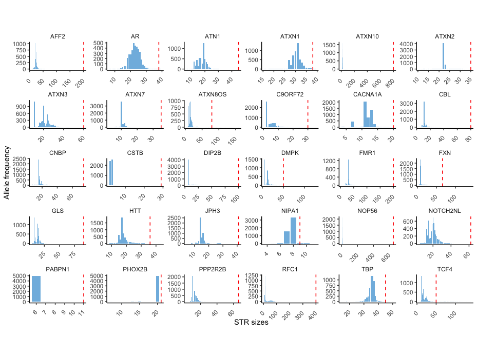
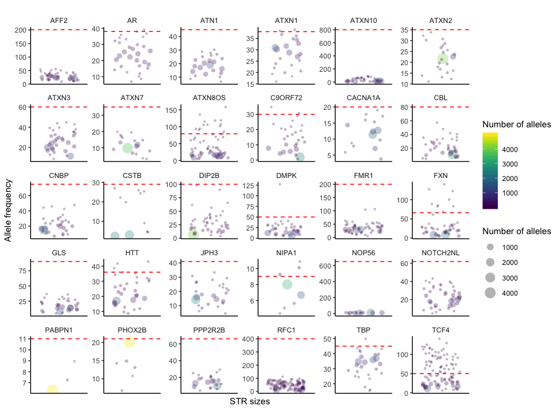
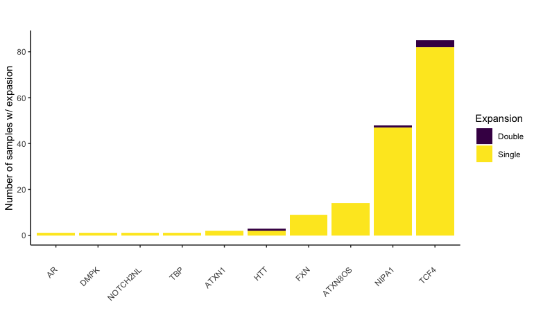
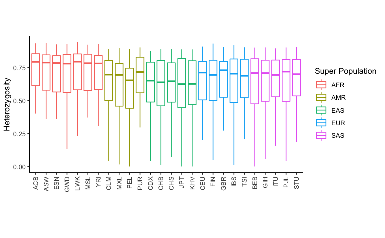
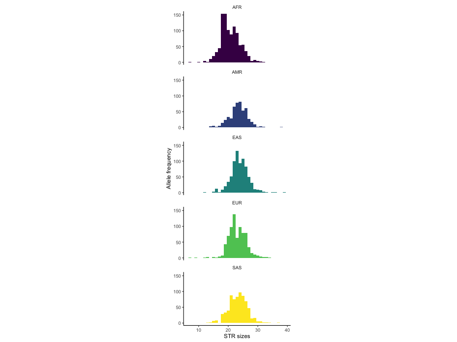

# Size distribution of pathogenic STRs in 1000 Genomes Project samples

Here we analyzed size distribution of pathogenic STRs within 2,271 samples from 1000 Genomes Project. In particular, we examined samples with pathogenic expansions and polymorphism stratified by populations.

## Summary of putative pathogenic expansions

We examined literatures and tried best to come up with threshold for known pathogenic STRs to cause diseases though not all of them have a clear cutoff due to lack of clinical data. We compared the size distribution of pathogenic STRs in presumably healthy individuals from 1000 Genomes Project with pathogenic thresholds and identified individuals with putative pathogenic expansions.

Vast majority of STRs are much shorter compared to pathogenic ranges.

While in some cases, some STRs are expanded.

In total, there are 165 cases that pass pathogenic thresholds. And most of them are from TCF4, NIPA1, and ATXN8OS.

We manually examined those cases and verified calls as listed below. Specifically, we generated plots to visualize alignments for each case using [REViewer](https://github.com/Illumina/REViewer) to verify the call. 

### AR
CAG repeat in AR gene has been associated with Spinobulbar muscular atrophy (SBMA). We observed one individual with 39 copies. While repeat size >38 has been considered full penetrance alleles by previous literatures ([La Spada et al., 1991](https://pubmed.ncbi.nlm.nih.gov/2062380/), [Atsuta et al., 2006](https://pubmed.ncbi.nlm.nih.gov/16621916/), [Fratta et al., 2014](https://pubmed.ncbi.nlm.nih.gov/24814851/)), patients reported all have at least 40 copies. Therefore, expansions with 39 copies are likely not pathogenic.

| Locus    | Sample | Genotype | Visualization                  |
|----------|---------|----------|--------------------------------|
| AR       | HG01808 | 23/39    | [Visualization](pileups/HG01808_AR.alignment.pdf)       |

### ATXN1
CAG repeat in ATXN1 gene has been associated with Spinocerebellar ataxia type 1 (SCA1). While CAG repeats with 39 or more copies is considered full penetrance alleles ([Quan et al 1995](https://www.ncbi.nlm.nih.gov/pubmed/8634720), [Servadio et al 1995](https://www.ncbi.nlm.nih.gov/pubmed/7647801), [Goldfarb et al 1996](https://www.ncbi.nlm.nih.gov/pubmed/8619528)), both individuals below are with CAT interruptions and the expansions are probably not pathogenic.

| Locus    | Sample | Genotype | Visualization                  |
|----------|---------|----------|--------------------------------|
| ATXN1    | HG00122 | 30/39    | [Visualization](pileups/HG00122_ATXN1.alignment.pdf)    |
| ATXN1    | HG03871 | 29/39    | [Visualization](pileups/HG03871_ATXN1.alignment.pdf)    |

### ATXN8OS
CTG repeat in ATXN8/ATXN8OS gene has been associated with Spinocerebellar ataxia type 8 (SCA8). Current reference ranges are based on total number of (CTA)n(CTG)n. Repeat sizes most associated with ataxia range from 80 to 250. However, repeat sizes from 70 up to 1300 repeats have been observed in individuals without ataxia ([GeneReviews](https://www.ncbi.nlm.nih.gov/books/NBK1268)). Therefore, whether expansions below are pathogenic or false positives remain unclear.

| Locus    | Sample | Genotype | Visualization                  |
|----------|---------|----------|--------------------------------|
| ATXN8OS  | HG00101 | 17/118   | [Visualization](pileups/HG00101_ATXN8OS.alignment.pdf)  |
| ATXN8OS  | HG00180 | 16/101   | [Visualization](pileups/HG00180_ATXN8OS.alignment.pdf)  |
| ATXN8OS  | HG00342 | 16/106   | [Visualization](pileups/HG00342_ATXN8OS.alignment.pdf)  |
| ATXN8OS  | HG01286 | 15/105   | [Visualization](pileups/HG01286_ATXN8OS.alignment.pdf)  |
| ATXN8OS  | HG01699 | 16/93    | [Visualization](pileups/HG01699_ATXN8OS.alignment.pdf)  |
| ATXN8OS  | HG02315 | 11/119   | [Visualization](pileups/HG02315_ATXN8OS.alignment.pdf)  |
| ATXN8OS  | HG02512 | 22/115   | [Visualization](pileups/HG02512_ATXN8OS.alignment.pdf)  |
| ATXN8OS  | NA12249 | 15/158   | [Visualization](pileups/NA12249_ATXN8OS.alignment.pdf)  |
| ATXN8OS  | NA18533 | 15/107   | [Visualization](pileups/NA18533_ATXN8OS.alignment.pdf)  |
| ATXN8OS  | NA18942 | 21/94    | [Visualization](pileups/NA18942_ATXN8OS.alignment.pdf)  |
| ATXN8OS  | NA18952 | 17/136   | [Visualization](pileups/NA18952_ATXN8OS.alignment.pdf)  |
| ATXN8OS  | NA19679 | 9/91     | [Visualization](pileups/NA19679_ATXN8OS.alignment.pdf)  |
| ATXN8OS  | NA20541 | 19/85    | [Visualization](pileups/NA20541_ATXN8OS.alignment.pdf)  |
| ATXN8OS  | NA20798 | 16/93    | [Visualization](pileups/NA20798_ATXN8OS.alignment.pdf)  |

### DMPK
CTG repeat in DMPK gene has been associated with Myotonic dystrophy type 1 (DM1). Expansions >50 CTG repeats are considered as full penetrance alleles and are associated with disease manifestations ([International Myotonic Dystrophy Consortium 2000](https://www.ncbi.nlm.nih.gov/pubmed/10746587)). The expansions listed below may be pathogenic or incorrect call.

| Locus    | Sample | Genotype | Visualization                  |
|----------|---------|----------|--------------------------------|
| DMPK     | NA19755 | 5/127    | [Visualization](pileups/NA19755_DMPK.alignment.pdf)     |

### FXN
GAA repeat in FXN gene has been associated with Friedreich's ataxia (FRDA). We identified a few individuals with expansions longer than full penetrance threshold (>66 bp) ([Campuzano et al 1996](https://www.ncbi.nlm.nih.gov/pubmed/8596916), [Dürr et al 1996](https://www.ncbi.nlm.nih.gov/pubmed/8815938), [Filla et al 1996]( https://www.ncbi.nlm.nih.gov/pubmed/8751856), [Epplen et al 1997](https://www.ncbi.nlm.nih.gov/pubmed/9187683)). Since the repeat is recessive and none of those individuals are with double expansions, they are likely just carriers.

| Locus    | Sample | Genotype | Visualization                  |
|----------|---------|----------|--------------------------------|
| FXN      | HG00265 | 19/88    | [Visualization](pileups/HG00265_FXN.alignment.pdf)     |
| FXN      | HG01438 | 21/122   | [Visualization](pileups/HG01438_FXN.alignment.pdf)     |
| FXN      | HG03757 | 8/68     | [Visualization](pileups/HG03757_FXN.alignment.pdf)     |
| FXN      | HG03823 | 8/83     | [Visualization](pileups/HG03823_FXN.alignment.pdf)     |
| FXN      | NA11832 | 8/100    | [Visualization](pileups/NA11832_FXN.alignment.pdf)     |
| FXN      | NA11894 | 8/127    | [Visualization](pileups/NA11894_FXN.alignment.pdf)     |
| FXN      | NA20766 | 9/82     | [Visualization](pileups/NA20766_FXN.alignment.pdf)     |
| FXN      | NA20771 | 19/140   | [Visualization](pileups/NA20771_FXN.alignment.pdf)     |
| FXN      | NA21119 | 8/100    | [Visualization](pileups/NA21119_FXN.alignment.pdf)     |

### HTT
CAG repeat has been associated with Huntington’s disease (HD). Alleles of 40 or more repeats are considered full penetrance alleles and are associated with development of HD with great certainty ([GeneReviews](https://www.ncbi.nlm.nih.gov/books/NBK1305)). The three expansions listed below may be incorrect calls. 

| Locus    | Sample | Genotype | Visualization                  |
|----------|---------|----------|--------------------------------|
| HTT      | HG02275 | 43/43    | [Visualization](pileups/HG02275_HTT.alignment.pdf)     |
| HTT      | HG02470 | 15/42    | [Visualization](pileups/HG02470_HTT.alignment.pdf)     |
| HTT      | NA19466 | 17/39    | [Visualization](pileups/NA19466_HTT.alignment.pdf)     |

### NIPA1
GCG repeat has been associated with Amyotrophic Lateral Sclerosis (ALS). Carriers of 8 or more repeats are of significantly higher susceptibility but it is not deterministic ([Blauw et al 2012](https://pubmed.ncbi.nlm.nih.gov/22378146)).

| Locus    | Sample | Genotype | Visualization                  |
|----------|---------|----------|--------------------------------|
| NIPA1    | HG00103 | 8/10     | [Visualization](pileups/HG00103_NIPA1.alignment.pdf)   |
| NIPA1    | HG00190 | 8/10     | [Visualization](pileups/HG00190_NIPA1.alignment.pdf)   |
| NIPA1    | HG00259 | 8/10     | [Visualization](pileups/HG00259_NIPA1.alignment.pdf)   |
| NIPA1    | HG00273 | 8/10     | [Visualization](pileups/HG00273_NIPA1.alignment.pdf)   |
| NIPA1    | HG00277 | 7/10     | [Visualization](pileups/HG00277_NIPA1.alignment.pdf)   |
| NIPA1    | HG00278 | 8/10     | [Visualization](pileups/HG00278_NIPA1.alignment.pdf)   |
| NIPA1    | HG00310 | 8/10     | [Visualization](pileups/HG00310_NIPA1.alignment.pdf)   |
| NIPA1    | HG01462 | 8/10     | [Visualization](pileups/HG01462_NIPA1.alignment.pdf)   |
| NIPA1    | HG02179 | 7/11     | [Visualization](pileups/HG02179_NIPA1.alignment.pdf)   |
| NIPA1    | HG02283 | 8/10     | [Visualization](pileups/HG02283_NIPA1.alignment.pdf)   |
| NIPA1    | HG02477 | 8/11     | [Visualization](pileups/HG02477_NIPA1.alignment.pdf)   |
| NIPA1    | HG02536 | 7/10     | [Visualization](pileups/HG02536_NIPA1.alignment.pdf)   |
| NIPA1    | HG03015 | 7/10     | [Visualization](pileups/HG03015_NIPA1.alignment.pdf)   |
| NIPA1    | HG03049 | 8/10     | [Visualization](pileups/HG03049_NIPA1.alignment.pdf)   |
| NIPA1    | HG03074 | 8/10     | [Visualization](pileups/HG03074_NIPA1.alignment.pdf)   |
| NIPA1    | HG03103 | 8/10     | [Visualization](pileups/HG03103_NIPA1.alignment.pdf)   |
| NIPA1    | HG03117 | 8/10     | [Visualization](pileups/HG03117_NIPA1.alignment.pdf)   |
| NIPA1    | HG03259 | 8/10     | [Visualization](pileups/HG03259_NIPA1.alignment.pdf)   |
| NIPA1    | HG03270 | 7/10     | [Visualization](pileups/HG03270_NIPA1.alignment.pdf)   |
| NIPA1    | HG03378 | 7/10     | [Visualization](pileups/HG03378_NIPA1.alignment.pdf)   |
| NIPA1    | HG03565 | 7/10     | [Visualization](pileups/HG03565_NIPA1.alignment.pdf)   |
| NIPA1    | HG03600 | 8/10     | [Visualization](pileups/HG03600_NIPA1.alignment.pdf)   |
| NIPA1    | HG03629 | 8/10     | [Visualization](pileups/HG03629_NIPA1.alignment.pdf)   |
| NIPA1    | HG03692 | 8/10     | [Visualization](pileups/HG03692_NIPA1.alignment.pdf)   |
| NIPA1    | HG03812 | 8/10     | [Visualization](pileups/HG03812_NIPA1.alignment.pdf)   |
| NIPA1    | HG03866 | 7/10     | [Visualization](pileups/HG03866_NIPA1.alignment.pdf)   |
| NIPA1    | HG03867 | 8/10     | [Visualization](pileups/HG03867_NIPA1.alignment.pdf)   |
| NIPA1    | HG04035 | 8/10     | [Visualization](pileups/HG04035_NIPA1.alignment.pdf)   |
| NIPA1    | HG04106 | 8/10     | [Visualization](pileups/HG04106_NIPA1.alignment.pdf)   |
| NIPA1    | HG04144 | 9/10     | [Visualization](pileups/HG04144_NIPA1.alignment.pdf)   |
| NIPA1    | NA11994 | 8/10     | [Visualization](pileups/NA11994_NIPA1.alignment.pdf)   |
| NIPA1    | NA12751 | 7/10     | [Visualization](pileups/NA12751_NIPA1.alignment.pdf)   |
| NIPA1    | NA12760 | 8/10     | [Visualization](pileups/NA12760_NIPA1.alignment.pdf)   |
| NIPA1    | NA12778 | 8/10     | [Visualization](pileups/NA12778_NIPA1.alignment.pdf)   |
| NIPA1    | NA12874 | 8/10     | [Visualization](pileups/NA12874_NIPA1.alignment.pdf)   |
| NIPA1    | NA18969 | 8/10     | [Visualization](pileups/NA18969_NIPA1.alignment.pdf)   |
| NIPA1    | NA19116 | 7/10     | [Visualization](pileups/NA19116_NIPA1.alignment.pdf)   |
| NIPA1    | NA19143 | 8/10     | [Visualization](pileups/NA19143_NIPA1.alignment.pdf)   |
| NIPA1    | NA19310 | 8/10     | [Visualization](pileups/NA19310_NIPA1.alignment.pdf)   |
| NIPA1    | NA19437 | 7/10     | [Visualization](pileups/NA19437_NIPA1.alignment.pdf)   |
| NIPA1    | NA19700 | 8/10     | [Visualization](pileups/NA19700_NIPA1.alignment.pdf)   |
| NIPA1    | NA19774 | 7/10     | [Visualization](pileups/NA19774_NIPA1.alignment.pdf)   |
| NIPA1    | NA20503 | 8/10     | [Visualization](pileups/NA20503_NIPA1.alignment.pdf)   |
| NIPA1    | NA20785 | 8/10     | [Visualization](pileups/NA20785_NIPA1.alignment.pdf)   |
| NIPA1    | NA20809 | 10/10    | [Visualization](pileups/NA20809_NIPA1.alignment.pdf)   |
| NIPA1    | NA20862 | 8/10     | [Visualization](pileups/NA20862_NIPA1.alignment.pdf)   |
| NIPA1    | NA20877 | 8/10     | [Visualization](pileups/NA20877_NIPA1.alignment.pdf)   |
| NIPA1    | NA21107 | 8/10     | [Visualization](pileups/NA21107_NIPA1.alignment.pdf)   |

### NOTCH2NL
We only found one individual with NOTCH2NL expansion and it has been marked as Low Depth and failed the filter.

| Locus    | Sample  | Genotype | Visualization                  |
|----------|---------|----------|--------------------------------|
| NOTCH2NL | HG00580 | 9/90     | [Visualization](pileups/HG00580_NOTCH2NL.alignment.pdf)|

### TBP
CAG or CAA repeat in TBP gene has been associated with Spinocerebellar ataxia type 17 (SCA17). 49 or greater CAG/CAA repeats are considered as full penetrance alleles ([GeneReviews](https://www.ncbi.nlm.nih.gov/books/NBK1438)). We are unsure about interruptions due to lack of full spanning reads for allele with 50 repeats.

| Locus    | Sample | Genotype | Visualization                  |
|----------|---------|----------|--------------------------------|
| TBP      | HG01868 | 35/50    | [Visualization](pileups/HG01868_TBP.alignment.pdf)     |

### TCF4
CTG repeat in TCF4 has been associated with Fuchs endothelial corneal dystrophy (FECD). While alleles with 50 or more repeats are considered pathogenic ([Wieben et al 2012](https://pubmed.ncbi.nlm.nih.gov/23185296/)), the repeat has been shown to affect TCF4 expression instead of protein functions ([Okumura et al 2019](https://pubmed.ncbi.nlm.nih.gov/30811544)).

| Locus    | Sample | Genotype | Visualization                  |
|----------|---------|----------|--------------------------------|
| TCF4     | NA12546 | 14/73    | [Visualization](pileups/NA12546_TCF4.alignment.pdf)    |
| TCF4     | HG00133 | 11/61    | [Visualization](pileups/HG00133_TCF4.alignment.pdf)    |
| TCF4     | HG00160 | 16/74    | [Visualization](pileups/HG00160_TCF4.alignment.pdf)    |
| TCF4     | HG00231 | 11/115   | [Visualization](pileups/HG00231_TCF4.alignment.pdf)    |
| TCF4     | HG00233 | 11/75    | [Visualization](pileups/HG00233_TCF4.alignment.pdf)    |
| TCF4     | HG00264 | 100/100  | [Visualization](pileups/HG00264_TCF4.alignment.pdf)    |
| TCF4     | HG00269 | 23/66    | [Visualization](pileups/HG00269_TCF4.alignment.pdf)    |
| TCF4     | HG00308 | 14/120   | [Visualization](pileups/HG00308_TCF4.alignment.pdf)    |
| TCF4     | HG00332 | 11/75    | [Visualization](pileups/HG00332_TCF4.alignment.pdf)    |
| TCF4     | HG00350 | 17/69    | [Visualization](pileups/HG00350_TCF4.alignment.pdf)    |
| TCF4     | HG00524 | 26/80    | [Visualization](pileups/HG00524_TCF4.alignment.pdf)    |
| TCF4     | HG00525 | 17/92    | [Visualization](pileups/HG00525_TCF4.alignment.pdf)    |
| TCF4     | HG00536 | 21/92    | [Visualization](pileups/HG00536_TCF4.alignment.pdf)    |
| TCF4     | HG00708 | 11/73    | [Visualization](pileups/HG00708_TCF4.alignment.pdf)    |
| TCF4     | HG01101 | 17/106   | [Visualization](pileups/HG01101_TCF4.alignment.pdf)    |
| TCF4     | HG01134 | 17/110   | [Visualization](pileups/HG01134_TCF4.alignment.pdf)    |
| TCF4     | HG01360 | 27/52    | [Visualization](pileups/HG01360_TCF4.alignment.pdf)    |
| TCF4     | HG01362 | 11/119   | [Visualization](pileups/HG01362_TCF4.alignment.pdf)    |
| TCF4     | HG01444 | 11/100   | [Visualization](pileups/HG01444_TCF4.alignment.pdf)    |
| TCF4     | HG01518 | 15/72    | [Visualization](pileups/HG01518_TCF4.alignment.pdf)    |
| TCF4     | HG01525 | 17/69    | [Visualization](pileups/HG01525_TCF4.alignment.pdf)    |
| TCF4     | HG01550 | 15/106   | [Visualization](pileups/HG01550_TCF4.alignment.pdf)    |
| TCF4     | HG01577 | 17/64    | [Visualization](pileups/HG01577_TCF4.alignment.pdf)    |
| TCF4     | HG01600 | 22/54    | [Visualization](pileups/HG01600_TCF4.alignment.pdf)    |
| TCF4     | HG01669 | 14/63    | [Visualization](pileups/HG01669_TCF4.alignment.pdf)    |
| TCF4     | HG01673 | 15/88    | [Visualization](pileups/HG01673_TCF4.alignment.pdf)    |
| TCF4     | HG01775 | 11/81    | [Visualization](pileups/HG01775_TCF4.alignment.pdf)    |
| TCF4     | HG01789 | 15/61    | [Visualization](pileups/HG01789_TCF4.alignment.pdf)    |
| TCF4     | HG01791 | 26/72    | [Visualization](pileups/HG01791_TCF4.alignment.pdf)    |
| TCF4     | HG01843 | 25/90    | [Visualization](pileups/HG01843_TCF4.alignment.pdf)    |
| TCF4     | HG01914 | 15/70    | [Visualization](pileups/HG01914_TCF4.alignment.pdf)    |
| TCF4     | HG01947 | 6/117    | [Visualization](pileups/HG01947_TCF4.alignment.pdf)    |
| TCF4     | HG02087 | 15/86    | [Visualization](pileups/HG02087_TCF4.alignment.pdf)    |
| TCF4     | HG02147 | 11/91    | [Visualization](pileups/HG02147_TCF4.alignment.pdf)    |
| TCF4     | HG02220 | 26/70    | [Visualization](pileups/HG02220_TCF4.alignment.pdf)    |
| TCF4     | HG02351 | 16/102   | [Visualization](pileups/HG02351_TCF4.alignment.pdf)    |
| TCF4     | HG02380 | 11/102   | [Visualization](pileups/HG02380_TCF4.alignment.pdf)    |
| TCF4     | HG02398 | 11/71    | [Visualization](pileups/HG02398_TCF4.alignment.pdf)    |
| TCF4     | HG02397 | 23/92    | [Visualization](pileups/HG02397_TCF4.alignment.pdf)    |
| TCF4     | HG02408 | 22/94    | [Visualization](pileups/HG02408_TCF4.alignment.pdf)    |
| TCF4     | HG02445 | 23/66    | [Visualization](pileups/HG02445_TCF4.alignment.pdf)    |
| TCF4     | HG02657 | 31/75    | [Visualization](pileups/HG02657_TCF4.alignment.pdf)    |
| TCF4     | HG02790 | 26/63    | [Visualization](pileups/HG02790_TCF4.alignment.pdf)    |
| TCF4     | HG02895 | 30/112   | [Visualization](pileups/HG02895_TCF4.alignment.pdf)    |
| TCF4     | HG03785 | 11/64    | [Visualization](pileups/HG03785_TCF4.alignment.pdf)    |
| TCF4     | HG03824 | 11/114   | [Visualization](pileups/HG03824_TCF4.alignment.pdf)    |
| TCF4     | HG03910 | 17/74    | [Visualization](pileups/HG03910_TCF4.alignment.pdf)    |
| TCF4     | HG04029 | 29/93    | [Visualization](pileups/HG04029_TCF4.alignment.pdf)    |
| TCF4     | HG04146 | 24/63    | [Visualization](pileups/HG04146_TCF4.alignment.pdf)    |
| TCF4     | HG04177 | 25/80    | [Visualization](pileups/HG04177_TCF4.alignment.pdf)    |
| TCF4     | HG04210 | 11/112   | [Visualization](pileups/HG04210_TCF4.alignment.pdf)    |
| TCF4     | NA07056 | 18/93    | [Visualization](pileups/NA07056_TCF4.alignment.pdf)    |
| TCF4     | NA11829 | 11/91    | [Visualization](pileups/NA11829_TCF4.alignment.pdf)    |
| TCF4     | NA12347 | 96/96    | [Visualization](pileups/NA12347_TCF4.alignment.pdf)    |
| TCF4     | NA12348 | 27/125   | [Visualization](pileups/NA12348_TCF4.alignment.pdf)    |
| TCF4     | NA12400 | 23/90    | [Visualization](pileups/NA12400_TCF4.alignment.pdf)    |
| TCF4     | NA12750 | 17/82    | [Visualization](pileups/NA12750_TCF4.alignment.pdf)    |
| TCF4     | NA12775 | 10/72    | [Visualization](pileups/NA12775_TCF4.alignment.pdf)    |
| TCF4     | NA18564 | 11/71    | [Visualization](pileups/NA18564_TCF4.alignment.pdf)    |
| TCF4     | NA18945 | 11/113   | [Visualization](pileups/NA18945_TCF4.alignment.pdf)    |
| TCF4     | NA19017 | 11/88    | [Visualization](pileups/NA19017_TCF4.alignment.pdf)    |
| TCF4     | NA19057 | 11/80    | [Visualization](pileups/NA19057_TCF4.alignment.pdf)    |
| TCF4     | NA19309 | 20/129   | [Visualization](pileups/NA19309_TCF4.alignment.pdf)    |
| TCF4     | NA19314 | 11/71    | [Visualization](pileups/NA19314_TCF4.alignment.pdf)    |
| TCF4     | NA19320 | 19/87    | [Visualization](pileups/NA19320_TCF4.alignment.pdf)    |
| TCF4     | NA19328 | 18/62    | [Visualization](pileups/NA19328_TCF4.alignment.pdf)    |
| TCF4     | NA19439 | 24/92    | [Visualization](pileups/NA19439_TCF4.alignment.pdf)    |
| TCF4     | NA19649 | 25/96    | [Visualization](pileups/NA19649_TCF4.alignment.pdf)    |
| TCF4     | NA19684 | 14/103   | [Visualization](pileups/NA19684_TCF4.alignment.pdf)    |
| TCF4     | NA19786 | 74/74    | [Visualization](pileups/NA19786_TCF4.alignment.pdf)    |
| TCF4     | NA19901 | 23/82    | [Visualization](pileups/NA19901_TCF4.alignment.pdf)    |
| TCF4     | NA20294 | 20/58    | [Visualization](pileups/NA20294_TCF4.alignment.pdf)    |
| TCF4     | NA20296 | 11/56    | [Visualization](pileups/NA20296_TCF4.alignment.pdf)    |
| TCF4     | NA20351 | 11/140   | [Visualization](pileups/NA20351_TCF4.alignment.pdf)    |
| TCF4     | NA20412 | 19/52    | [Visualization](pileups/NA20412_TCF4.alignment.pdf)    |
| TCF4     | NA20513 | 11/101   | [Visualization](pileups/NA20513_TCF4.alignment.pdf)    |
| TCF4     | NA20773 | 25/98    | [Visualization](pileups/NA20773_TCF4.alignment.pdf)    |
| TCF4     | NA20783 | 14/90    | [Visualization](pileups/NA20783_TCF4.alignment.pdf)    |
| TCF4     | NA20792 | 11/64    | [Visualization](pileups/NA20792_TCF4.alignment.pdf)    |
| TCF4     | NA20804 | 11/95    | [Visualization](pileups/NA20804_TCF4.alignment.pdf)    |
| TCF4     | NA20812 | 46/101   | [Visualization](pileups/NA20812_TCF4.alignment.pdf)    |
| TCF4     | NA20850 | 17/106   | [Visualization](pileups/NA20850_TCF4.alignment.pdf)    |
| TCF4     | NA20856 | 19/79    | [Visualization](pileups/NA20856_TCF4.alignment.pdf)    |
| TCF4     | NA20885 | 16/88    | [Visualization](pileups/NA20885_TCF4.alignment.pdf)    |
| TCF4     | NA21128 | 22/61    | [Visualization](pileups/NA21128_TCF4.alignment.pdf)    |

## Summary of polymorphism stratified by populations
We further examined polymorphism of pathogenic STRs. As expected, we observed that AFR population has the highest polymorphism compared to other populations.

Take CAG repeat in AR gene as an example, AFR population is with more diverse distribution and has different prevalent alleles compared to other four super populations.

