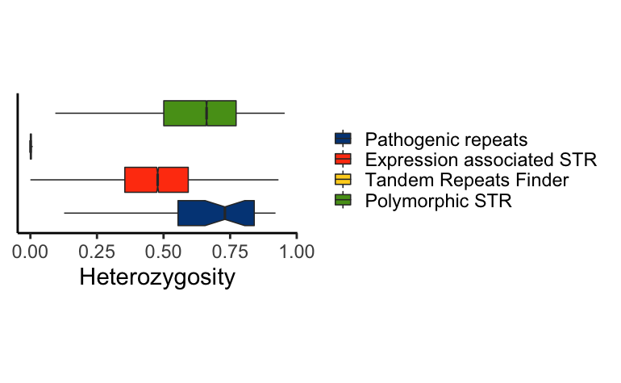
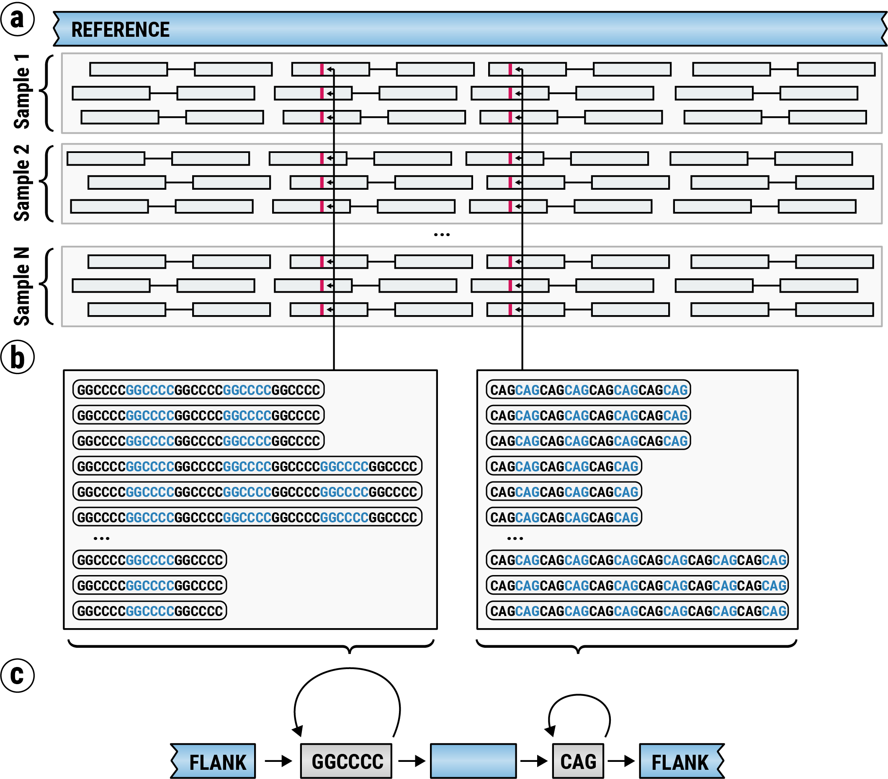

# Introduction to Polymorphic STR

## Motivation

Despite 40+ known pathogenic STR in [pathogenic STR](../../pathogenic_STR), a comprehensive STR catalog is still lacking, which prevents us from identifying novel pathogenic mutations or functional STRs and analyzing them. 

Existing genome-wide STR catalogs contain many incorrect and incomplete repeat annotations. For example, the state-of-art tool for defining variant catalogs is [Tandem Repeat Finder](https://tandem.bu.edu/trf/trf.html) (TRF). While the TRF usually produces a comprehensive repeat annotation, not all annotated repeats are curated for targeted analysis. More importantly, while vast majority of functional STRs are highly polymorphic, STRs annotated by TRF are not polymorphic. Hence, they are not suitable for targeted analysis. In particular, they are likely not functional thus of no biological/clinical relevance. Also, many of those repeats have the same size in all individuals and are not informative.

  

## Approach

To solve the caveat of TRF, we developed STR-finder that infers STRs from read alignments at population levels. Briefly, insertions and deletions from short read alignment are summarized and parsed to extract repeat-like sequences, and repeats present in multiple samples are further processed to infer STR annotations. STR-finder was described in [Dolzhenko et al. 2019](https://academic.oup.com/bioinformatics/article/35/22/4754/5499079).

We run STR-Finder on ~800 samples from 1000 Genomes Project and yield candidate STRs. We specifically look for polymorphic but also common STRs by requiring >5% samples with alternative alleles, >85% sequences to be consistent, and >85% samples to have the same motif.

    

<b>Figure S5 from Dolzhenko et al. 2019</b>

We then run STR-QC to curate candidate STRs and only keep high-quality STRs. Specifically, we applied following filters.

* Filter by flank sequence (<5 Ns and with high complexity)
* Filter by coverage (overall coverage <100X and with normal flanking coverage)
* Filter by alignment quality (>95% match)
* Filter by mendelian inheritance error in trios (<10%)

In summary, we identified 37,413 STRs after removing overlaps with known pathogenic STRs.

